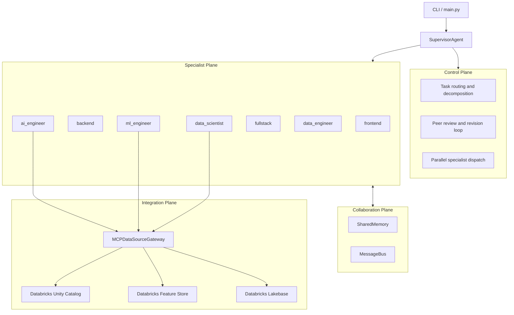
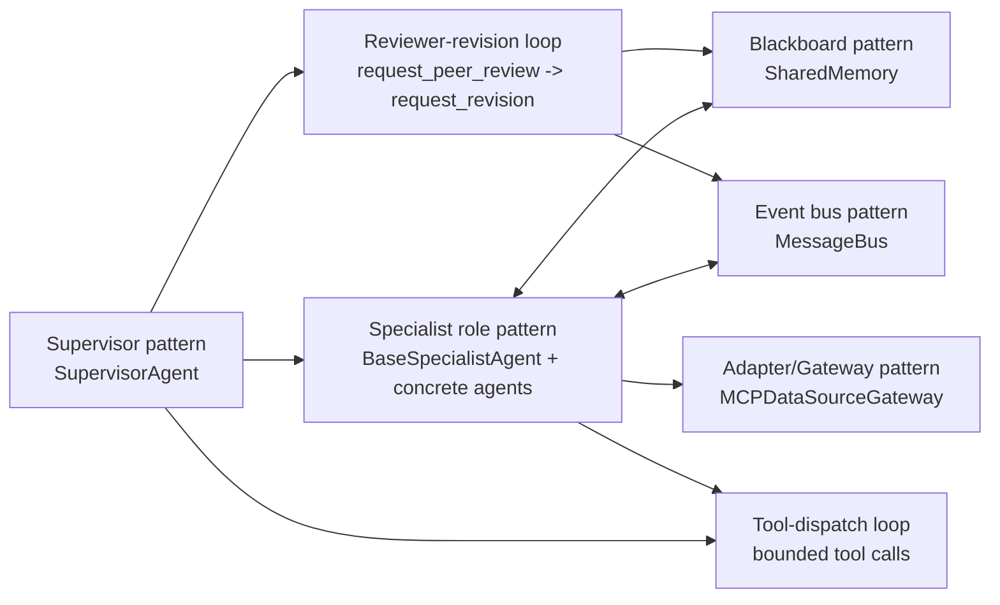

# Architecture

## System Overview

The application uses a supervisor-specialist architecture with four planes:

- Control Plane: task decomposition, routing, feedback loop.
- Specialist Plane: domain-focused agents execute delegated tasks.
- Collaboration Plane: shared memory and typed message bus.
- Integration Plane: MCP gateway for Databricks-backed data sources.



## Runtime Interaction

```text
User Task
  -> SupervisorAgent
     -> call_<specialist> / call_specialists_parallel
     -> request_peer_review
     -> request_revision
  -> Specialists use shared tools:
     - write_file/read_file/run_shell/list_files
     - memory_write/memory_read/memory_list
     - send_message/read_messages
     - mcp_retrieve
```

## Agent Design Patterns



- Supervisor pattern: centralized planning, delegation, synthesis.
- Specialist role pattern: domain-specialized behavior over shared capabilities.
- Blackboard pattern: decoupled coordination through namespaced memory keys.
- Event bus pattern: typed, asynchronous inter-agent communication.
- Reviewer-revision loop: quality gating via explicit critique and rework.
- Tool-dispatch loop: bounded iterative agent execution.
- Adapter/Gateway pattern: unified external data access through MCP gateway.

## Databricks MCP Integration

Core module:

- src/ai_app/integrations/mcp_data_sources.py

Supported source types:

- databricks_uc
- databricks_feature_store
- databricks_lakebase_mcp

Important behavior:

- Retrieval paths are unified through gateway.retrieve(...).
- Generated Databricks index flows are no-op by default; upstream pipelines own writes.
- ml_engineer is restricted to Feature Store MCP retrieval only.

## Key Components

- src/ai_app/main.py: CLI entrypoint and report output.
- src/ai_app/supervisor.py: orchestration and feedback control.
- src/ai_app/agents/base.py: specialist runtime loop and shared tools.
- src/ai_app/memory.py: file-backed shared state.
- src/ai_app/message_bus.py: typed message logging and inbox semantics.
