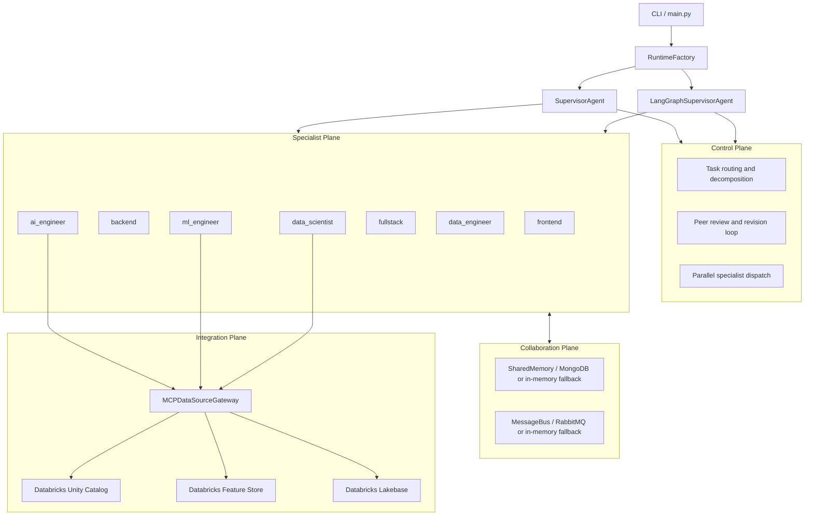
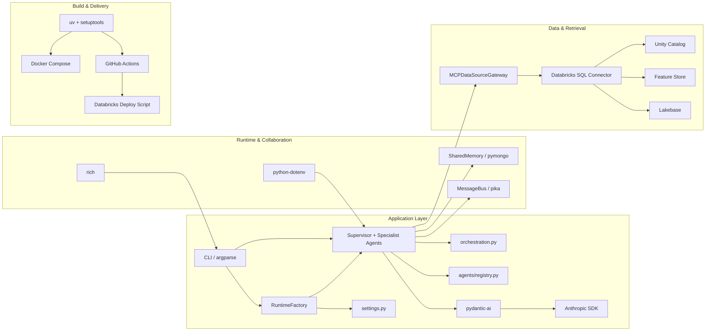
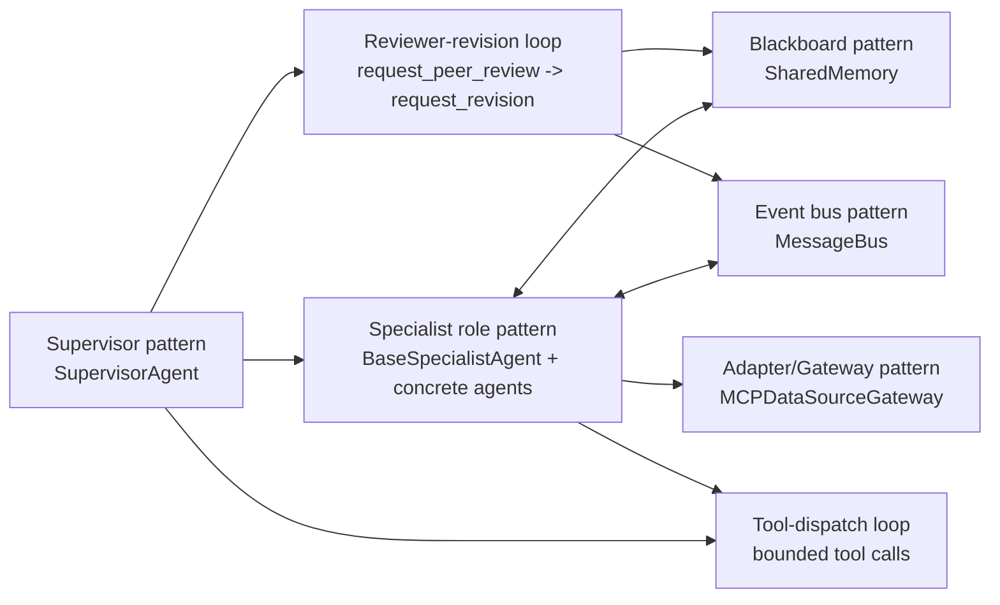

# Architecture

Related decisions are documented in [ADRs](adrs/README.md).

## System Overview

The application uses a supervisor-specialist architecture with four planes:

- Control Plane: task decomposition, routing, feedback loop.
- Specialist Plane: domain-focused agents execute delegated tasks.
- Collaboration Plane: shared memory and typed message bus.
- Integration Plane: MCP gateway for Databricks-backed data sources.



## Project Frameworks Diagram



## Runtime Interaction

```text
User Task
  -> RuntimeFactory (env + CLI resolved config)
     -> Anthropic client + SharedMemory + MessageBus
     -> SupervisorAgent or LangGraphSupervisorAgent
  -> Selected supervisor
     -> call_<specialist> / call_specialists_parallel
     -> request_peer_review
     -> request_revision
  -> Specialists use shared tools:
     - write_file/read_file/run_shell/list_files
     - memory_write/memory_read/memory_list
     - send_message/read_messages
     - mcp_retrieve
```

## Agent Design Patterns



- Supervisor pattern: centralized planning, delegation, synthesis.
- Specialist role pattern: domain-specialized behavior over shared capabilities.
- Blackboard pattern: decoupled coordination through namespaced memory keys.
- Event bus pattern: typed, durable inter-agent communication via RabbitMQ.
- Reviewer-revision loop: quality gating via explicit critique and rework.
- Tool-dispatch loop: bounded iterative agent execution.
- Adapter/Gateway pattern: unified external data access through MCP gateway.

## Databricks MCP Integration

Core module: `src/ai_app/integrations/mcp_data_sources.py`.

Supported source types:

- databricks_uc
- databricks_feature_store
- databricks_lakebase_mcp

Important behavior:

- Retrieval paths are unified through `gateway.retrieve(...)`.
- Generated Databricks index flows are no-op by default; upstream pipelines own writes.
- `ml_engineer` is restricted to Feature Store MCP retrieval only.

## Key Components

- `src/ai_app/main.py`: CLI entrypoint, argument parsing, and final report rendering.
- `src/ai_app/runtime_factory.py`: explicit environment-driven runtime assembly (client, memory, bus, selected supervisor).
- `src/ai_app/settings.py`: central model/runtime defaults (`ANTHROPIC_MODEL`, token and iteration caps).
- `src/ai_app/orchestration.py`: shared supervisor tool contracts and canonical system prompt.
- `src/ai_app/agents/registry.py`: specialist catalog and registry mapping used by both supervisor implementations.
- `src/ai_app/supervisor.py`: classic orchestration loop with tool-use and feedback control.
- `src/ai_app/supervisor_langgraph.py`: LangGraph state-machine orchestration implementation.
- `src/ai_app/agents/base.py`: Pydantic AI agent, `SpecialistDeps` injection, `@agent.tool` registration, and `AgentResult` Pydantic model.
- `src/ai_app/utils/memory.py`: MongoDB-backed shared state with in-memory fallback when MongoDB is unavailable.
- `src/ai_app/utils/message_bus.py`: RabbitMQ-backed typed message bus with in-memory fallback when RabbitMQ is unavailable.
